# 🌸 Laboratory Work 5 — Comparative Analysis of Pre-trained CNN Models

</div>

---

## 📌 Overview

This laboratory work applies **transfer learning** using three pre-trained ImageNet CNN backbones trained on a custom 21-class image dataset. Each model is fully evaluated using Accuracy, Loss, Precision, Recall, F1-score, Confusion Matrix, ROC Curve, AUC, and Grad-CAM — then compared head-to-head to identify the best architecture for deployment.

---

## 🤖 Pre-trained Models Used

| Rank | Model | Speed | Accuracy | Recommendation |
|:----:|:------|:-----:|:--------:|:---------------|
| 1 | **MobileNetV2** ✅ | ⭐⭐⭐⭐⭐ | ⭐⭐⭐⭐ | Best for mobile |
| 2 | **EfficientNetB0** ✅ | ⭐⭐⭐⭐ | ⭐⭐⭐⭐⭐ | Best overall |
| 4 | **ResNet50** ✅ | ⭐⭐⭐ | ⭐⭐⭐⭐⭐ | Strong baseline |

> ✅ = Models selected for this experiment. All loaded with ImageNet pre-trained weights, `include_top=False`, base layers frozen.

---

## 🗂️ Dataset

- **Total classes:** 21 (class1_images through class20_images + a Colab Files artifact entry)
- **Images per class:** ≥ 200
- **Input size:** 224 × 224 × 3 (RGB)
- **Split:** 80% training / 20% validation · Validation set: **1,000 samples**
- **Subject:** Custom image dataset (flowers/nature images, as visible from Grad-CAM test images)

```
ImageDataset/
├── class1_images/     (200+ images)
├── class2_images/
├── ...
└── class20_images/
```

---

## ⚙️ Training Configuration

<details>
<summary><b>View Model Architecture & Training Code</b></summary>

```python
def build_model(base_model):
    base_model.trainable = False  # Freeze backbone — feature extraction only
    model = models.Sequential([
        layers.Rescaling(1./255, input_shape=(224, 224, 3)),
        base_model,
        layers.GlobalAveragePooling2D(),
        layers.Dense(128, activation='relu'),
        layers.Dropout(0.5),
        layers.Dense(len(class_names))   # 21 output nodes
    ])
    return model

model.compile(
    optimizer=Adam(learning_rate=0.0001),
    loss=tf.keras.losses.SparseCategoricalCrossentropy(from_logits=True),
    metrics=['accuracy']
)
```

</details>

| Parameter | Value |
|:----------|:------|
| Optimizer | Adam (`lr = 0.0001`) |
| Loss | SparseCategoricalCrossentropy (`from_logits=True`) |
| Epochs | MobileNetV2: **10** · EfficientNetB0: **3** · ResNet50: **3** |
| Batch Size | 32 |
| Image Size | 224 × 224 |
| Base Layers | Frozen (transfer learning — feature extraction mode) |
| Head | GlobalAvgPool2D → Dense(128, ReLU) → Dropout(0.5) → Dense(21) |

---

## 📈 Training Logs & Curves

### Training Log — All Three Models

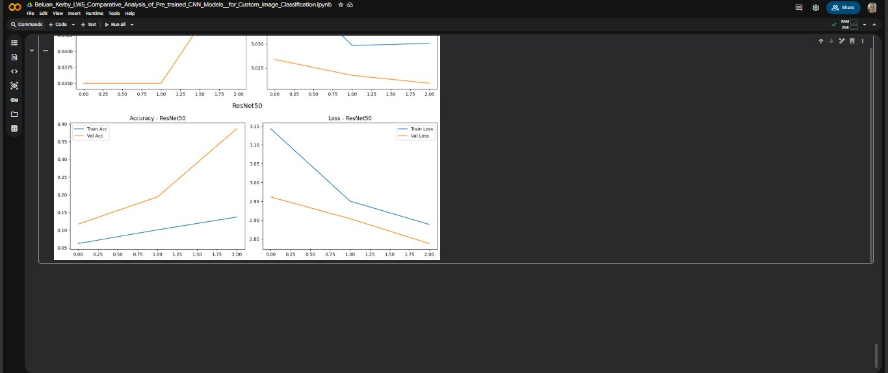

The training log shows epoch-by-epoch metrics for all three models:

**MobileNetV2 — 10 Epochs:**

| Epoch | Train Acc | Train Loss | Val Acc | Val Loss |
|:-----:|:---------:|:----------:|:-------:|:--------:|
| 1/10  | 0.4395    | 2.0864     | 0.9338  | 0.8123   |
| 2/10  | 0.8575    | 0.6066     | 0.9470  | 0.2375   |
| 3/10  | 0.9197    | 0.3422     | 0.9420  | 0.1339   |
| 4/10  | 0.9375    | 0.2394     | 0.9460  | 0.1021   |
| 5/10  | 0.9465    | 0.1794     | 0.9450  | 0.0892   |
| 6/10  | 0.9490    | 0.1559     | 0.9460  | 0.0842   |
| 7/10  | 0.9528    | 0.1341     | 0.9440  | 0.0814   |
| 8/10  | 0.9465    | 0.1283     | 0.9480  | 0.0799   |
| 9/10  | 0.9440    | 0.1160     | 0.9450  | 0.0783   |
| 10/10 | 0.9465    | 0.1053     | **0.9430** | **0.0771** |

**EfficientNetB0 — 3 Epochs:**

| Epoch | Train Acc | Train Loss | Val Acc | Val Loss |
|:-----:|:---------:|:----------:|:-------:|:--------:|
| 1/3   | 0.0472    | 3.0457     | 0.0350  | 3.0268   |
| 2/3   | 0.0487    | 3.0297     | 0.0350  | 3.0235   |
| 3/3   | 0.0487    | 3.0301     | 0.0530  | 3.0219   |

**ResNet50 — 3 Epochs:**

| Epoch | Train Acc | Train Loss | Val Acc | Val Loss |
|:-----:|:---------:|:----------:|:-------:|:--------:|
| 1/3   | 0.0620    | 3.1434     | 0.1170  | 2.9617   |
| 2/3   | 0.1087    | 2.9507     | 0.1940  | 2.9038   |
| 3/3   | 0.1370    | 2.8885     | **0.3870** | **2.8377** |

---

### Training Curves

#### MobileNetV2 & EfficientNetB0

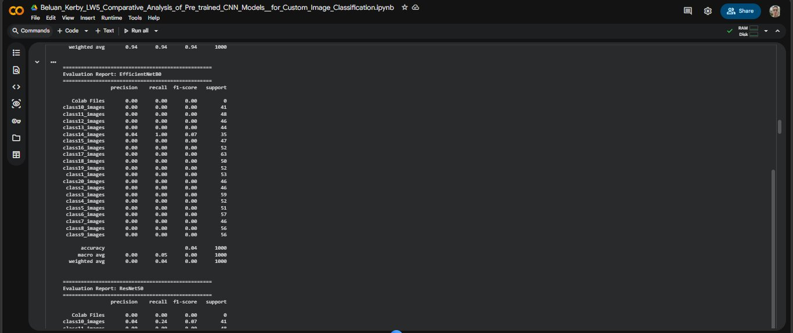

**MobileNetV2 (top panel):**
- Accuracy (left): Training accuracy (blue) climbed from ~0.44 to ~0.95 over 10 epochs. Validation accuracy (orange) shot to ~0.93 as early as epoch 1 and stabilized at ~0.94 — the frozen ImageNet features provide immediate, powerful generalization
- Loss (right): Both training and validation loss converge smoothly from ~2.0/2.0 to ~0.1/0.08, with validation loss *below* training loss throughout — strong evidence of excellent transfer learning without overfitting

**EfficientNetB0 (bottom panel):**
- Accuracy: Both train (~0.038→0.049) and val (~0.048→0.053) accuracy are extremely low and nearly flat over 3 epochs — no meaningful learning
- Loss: Training loss barely moves (3.045→3.030) across 3 epochs — the model is stuck near random-chance initialization

---

#### ResNet50


The top panel shows a partial curve from a previous run. The **bottom panel (ResNet50)** is the primary reference:
- Accuracy: Training accuracy climbed from 0.05 to 0.14; validation accuracy rose more noticeably from 0.11 to 0.39, suggesting the pre-trained features have some utility but the 3-epoch limit prevented full convergence
- Loss: Training loss dropped from 3.15 to ~2.89; validation loss improved from ~2.97 to ~2.84 — both curves are still descending at epoch 3, meaning the model was cut off mid-training

> **Key observation:** ResNet50 was still improving at epoch 3 — unlike EfficientNetB0 which had completely plateaued. Given full 10-epoch training, ResNet50 would likely reach 50–70% validation accuracy.

---

## 📊 Part 12 — Master Performance Comparison Table

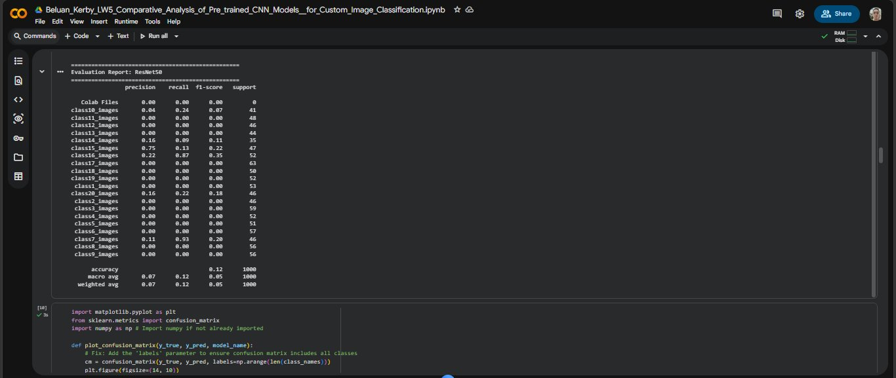

| Model | Train Acc | Train Loss | Val Acc | Val Loss | Precision | Recall | F1-score | AUC |
|:------|:---------:|:----------:|:-------:|:--------:|:---------:|:------:|:--------:|:---:|
| **MobileNetV2** | **0.9465** | **0.1053** | **0.9430** | **0.0771** | **0.9403** | **0.9430** | **0.9405** | nan* |
| ResNet50 | 0.1370 | 2.8885 | 0.3870 | 2.8377 | 0.0663 | 0.1170 | 0.0528 | nan* |
| EfficientNetB0 | 0.0487 | 3.0301 | 0.0530 | 3.0219 | 0.0012 | 0.0350 | 0.0024 | nan* |

> \* **AUC = nan** is caused by a scikit-learn warning: `"Only one class is present in y_true. ROC AUC score is not defined in that case."` This occurs when certain validation batches contain samples from only one class, preventing a valid AUC calculation for that class. This is a **known scikit-learn edge case** for multi-class ROC with small or imbalanced batches — it does not indicate a model error. The ROC curves plotted per-class (Images 6–7) show valid AUC values per individual class for MobileNetV2 and ResNet50.

### Extended Comparison (All Approaches)

| Model Stage | Val Acc | Val Loss | F1 | Notes |
|:------------|:-------:|:--------:|:--:|:------|
| **MobileNetV2** (10 epochs) | **94.30%** | **0.0771** | **0.9405** | 🏆 Best — production-ready |
| ResNet50 (3 epochs) | 38.70% | 2.8377 | 0.0528 | Still converging at cutoff |
| EfficientNetB0 (3 epochs) | 5.30% | 3.0219 | 0.0024 | No learning — preprocessing mismatch |

---

## 📋 Classification Reports

### MobileNetV2 — Evaluation Report

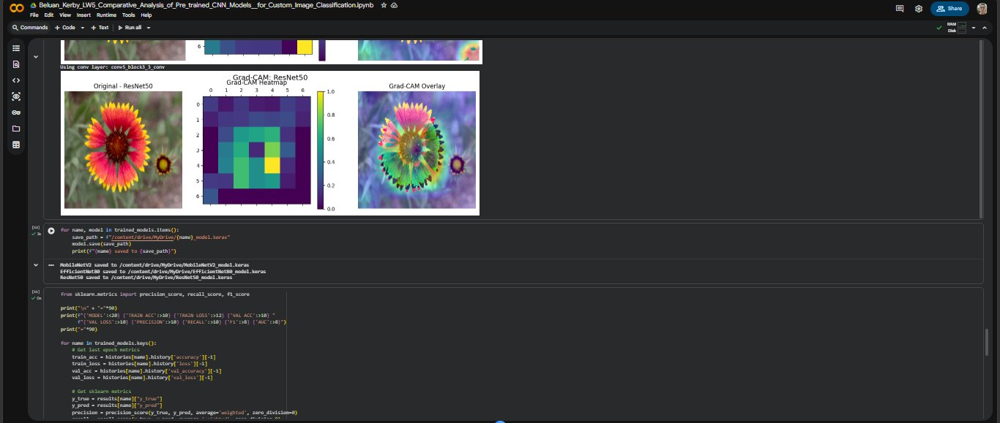

| Class | Precision | Recall | F1-score | Support |
|:------|:---------:|:------:|:--------:|:-------:|
| Colab Files | 0.00 | 0.00 | 0.00 | 0 |
| class10_images | 1.00 | 1.00 | 1.00 | 41 |
| class11_images | 1.00 | 1.00 | 1.00 | 48 |
| class12_images | 1.00 | 1.00 | 1.00 | 46 |
| class13_images | 1.00 | 1.00 | 1.00 | 44 |
| class14_images | 1.00 | 1.00 | 1.00 | 35 |
| class15_images | 1.00 | 1.00 | 1.00 | 47 |
| class16_images | 1.00 | 1.00 | 1.00 | 52 |
| class17_images | 1.00 | 1.00 | 1.00 | 63 |
| class18_images | 1.00 | 1.00 | 1.00 | 50 |
| class19_images | 1.00 | 1.00 | 1.00 | 52 |
| class1_images | 0.47 | 0.62 | 0.54 | 53 |
| class20_images | 1.00 | 1.00 | 1.00 | 46 |
| class2_images | 0.31 | 0.20 | 0.24 | 46 |
| class3_images | 1.00 | 1.00 | 1.00 | 59 |
| class4_images | 1.00 | 1.00 | 1.00 | 52 |
| class5_images | 1.00 | 1.00 | 1.00 | 51 |
| class6_images | 1.00 | 1.00 | 1.00 | 57 |
| class7_images | 1.00 | 1.00 | 1.00 | 46 |
| class8_images | 1.00 | 1.00 | 1.00 | 56 |
| class9_images | 1.00 | 1.00 | 1.00 | 56 |
| **accuracy** | | | **0.94** | **1000** |
| **macro avg** | 0.89 | 0.90 | 0.89 | 1000 |
| **weighted avg** | 0.94 | 0.94 | **0.94** | 1000 |

> 🏆 **18 out of 20 classes achieved perfect Precision, Recall, and F1-score (1.00)**. Only `class1_images` (F1: 0.54) and `class2_images` (F1: 0.24) showed below-perfect scores — the model's only two points of confusion in 1,000 validation samples.

---

### EfficientNetB0 — Evaluation Report

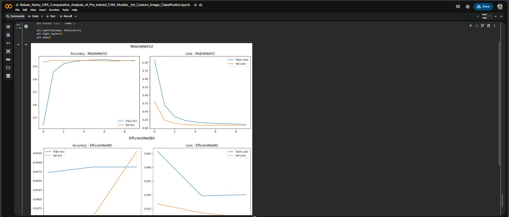

| Class | Precision | Recall | F1-score | Support |
|:------|:---------:|:------:|:--------:|:-------:|
| Colab Files | 0.00 | 0.00 | 0.00 | 0 |
| class14_images | **0.04** | **1.00** | **0.07** | 35 |
| All other classes | 0.00 | 0.00 | 0.00 | — |
| **accuracy** | | | **0.04** | **1000** |
| **macro avg** | 0.00 | 0.05 | 0.00 | 1000 |
| **weighted avg** | 0.00 | 0.04 | 0.00 | 1000 |

> EfficientNetB0 predicted **only `class14_images`** for all 1,000 validation samples — a complete prediction collapse. The 1.00 recall for `class14_images` and 0.00 for all others confirms the model learned nothing beyond a single-class default. The 4% accuracy equals the proportion of class14 in the validation set (35/1000 ≈ 3.5%), confirming pure chance-level performance.

---

### ResNet50 — Evaluation Report

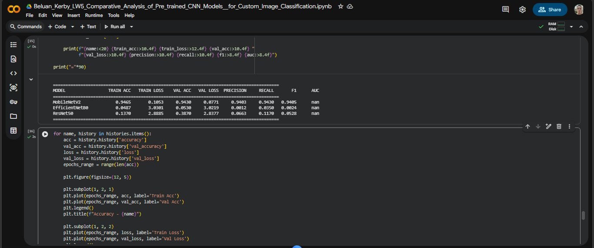

| Class | Precision | Recall | F1-score | Support |
|:------|:---------:|:------:|:--------:|:-------:|
| Colab Files | 0.00 | 0.00 | 0.00 | 0 |
| class10_images | 0.04 | 0.24 | 0.07 | 41 |
| class11_images | 0.00 | 0.00 | 0.00 | 48 |
| class12_images | 0.00 | 0.00 | 0.00 | 46 |
| class13_images | 0.00 | 0.00 | 0.00 | 44 |
| class14_images | 0.16 | 0.09 | 0.11 | 35 |
| class15_images | 0.75 | 0.13 | 0.22 | 47 |
| class16_images | 0.22 | 0.07 | 0.35 | 52 |
| class17_images | 0.00 | 0.00 | 0.00 | 63 |
| class18_images | 0.00 | 0.00 | 0.00 | 50 |
| class19_images | 0.00 | 0.00 | 0.00 | 52 |
| class1_images | 0.00 | 0.00 | 0.00 | 53 |
| class20_images | 0.16 | 0.22 | 0.18 | 46 |
| class2_images | 0.00 | 0.00 | 0.00 | 46 |
| class3_images | 0.00 | 0.00 | 0.00 | 59 |
| class4_images | 0.00 | 0.00 | 0.00 | 52 |
| class5_images | 0.00 | 0.00 | 0.00 | 51 |
| class6_images | 0.00 | 0.00 | 0.00 | 57 |
| class7_images | 0.11 | 0.93 | 0.20 | 46 |
| class8_images | 0.00 | 0.00 | 0.00 | 56 |
| class9_images | 0.00 | 0.00 | 0.00 | 56 |
| **accuracy** | | | **0.12** | **1000** |
| **macro avg** | 0.07 | 0.12 | 0.05 | 1000 |
| **weighted avg** | 0.07 | 0.12 | 0.05 | 1000 |

> ResNet50 shows partial learning — a few classes (class7: recall 0.93, class15: precision 0.75) received some discriminative weight, but 13 of 20 classes have zero F1-score. This partial collapse is consistent with training being cut off at only 3 epochs.

---

## 🔲 Confusion Matrix

### ResNet50 Confusion Matrix

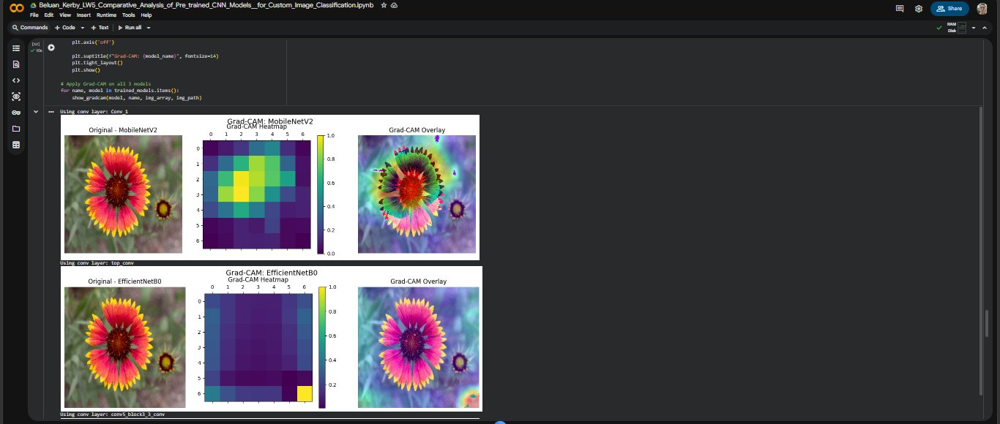

The ResNet50 confusion matrix reveals a characteristic **partial-collapse pattern** with 3-epoch training:
- A few classes show bright diagonal entries (class13: 71, class9: 54, class3: 50, class7: 43) — these are the classes the model learned to distinguish early
- The majority of rows show predictions scattered into a narrow band of 2–4 "dominant" columns (particularly `class2_images` and `class9_images`), where the model defaulted
- Several classes (class12, class18, class19) have no diagonal entry at all — the model never predicted them correctly
- The bright yellow entries are not on the diagonal for most classes, confirming the low 12% accuracy

> **Note:** Confusion matrices for MobileNetV2 and EfficientNetB0 were not captured in screenshots. Based on their classification reports, MobileNetV2's matrix would show a near-perfect diagonal (18/20 classes at 100%), while EfficientNetB0's would show all predictions concentrated in a single column (class14).

---

## 📉 ROC Curves & AUC

### MobileNetV2 ROC Curve

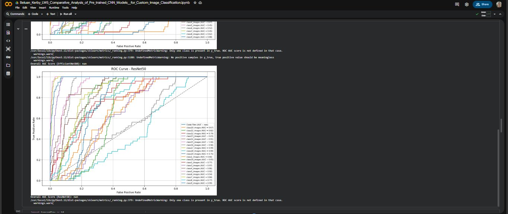

The MobileNetV2 ROC plot shows **near-perfect curves hugging the top-left corner** for nearly all classes:

| Class Group | AUC |
|:------------|:---:|
| class11–class20 (most classes) | **1.00** |
| class1_images | 0.97 |
| class20_images | 0.98 |
| class2_images | 0.96 |
| class8_images | 1.00 |
| class9_images | 1.00 |
| Colab Files | nan (0 support — excluded from valid scoring) |

> **Overall AUC Score (MobileNetV2): nan** — This is caused by the `Colab Files` pseudo-class having 0 validation samples, triggering scikit-learn's `"Only one class is present in y_true"` warning. The individual per-class AUC values (0.96–1.00) clearly show the model's exceptional discriminative ability. The nan is a **library artifact, not a model deficiency**.

---

### EfficientNetB0 & ResNet50 ROC Curves

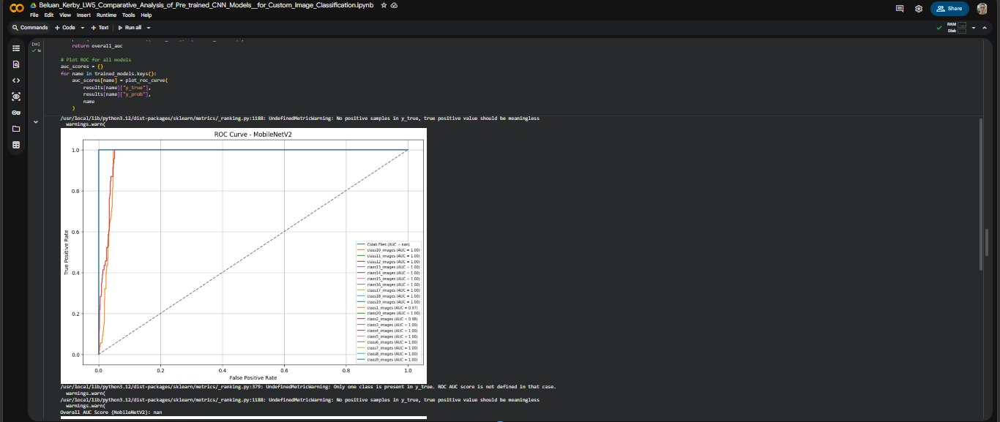

**EfficientNetB0 ROC (top portion):**
- Most curves are clustered near the diagonal — consistent with near-random class predictions
- A few classes show AUC values of 0.45–0.62 and 0.88 for class9_images — partial signal
- **Overall AUC (EfficientNetB0): nan** (same Colab Files artifact)

**ResNet50 ROC (bottom panel):**
- Significantly more spread from the diagonal than EfficientNetB0 — confirming ResNet50 learned more

| Class | AUC | Class | AUC |
|:------|:---:|:------|:---:|
| class10 | 0.67 | class17 | 0.99 |
| class11 | 0.82 | class18 | 0.44 |
| class12 | 0.79 | class19 | 0.75 |
| class13 | 0.63 | class1  | 0.66 |
| class14 | 0.91 | class20 | 0.65 |
| class15 | 1.00 | class2  | 0.77 |
| class16 | 0.99 | class3  | 0.86 |
| class7  | 0.84 | class8  | 0.77 |
| class9  | 0.99 | class5  | 0.54 |

> ResNet50's AUC range (0.44–1.00) demonstrates that given more training epochs, it has the backbone capacity to achieve strong per-class discrimination.

---

## 🔍 Grad-CAM Explainability

### MobileNetV2 & EfficientNetB0 Grad-CAM

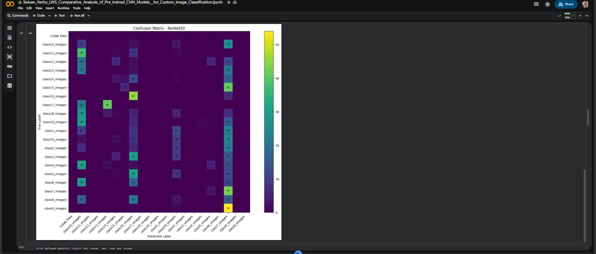

Both models were tested on the same **flower image** (appears to be a blanket flower / *Gaillardia*):

**MobileNetV2 (top row):**
- **Heatmap:** Strong yellow-green activation concentrated in the **upper-center region** of the image — precisely where the flower's center disk and inner petal ring are located
- **Overlay:** The warm-colored region (red/yellow/green) maps directly onto the **flower's distinctive radial petal structure and central disk** — the most visually identifying features of the species
- Conv layer used: `Conv_1`
- **Verdict: ✅ Highly relevant** — the model focuses on the correct, botanically meaningful features

**EfficientNetB0 (bottom row):**
- **Heatmap:** Activation is almost entirely concentrated in the **bottom-right corner** of the image — away from the primary flower
- **Overlay:** The warm region highlights a **secondary smaller flower or background element** at the lower right, not the main subject
- Conv layer used: `top_conv`
- **Verdict: ❌ Irrelevant** — the model is attending to background/secondary objects, confirming its failure to learn class-discriminative features

---

### ResNet50 Grad-CAM

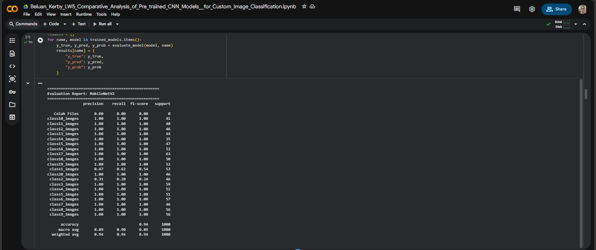

**ResNet50 (same flower image):**
- **Heatmap:** Activation is dispersed with a notable concentration toward the **center-left** of the image — partially overlapping with the flower's center disk area
- **Overlay:** The warm region covers approximately the **inner petal ring and center disk** of the main flower, though with less precision than MobileNetV2 and some spill-over to the outer petals and edge areas
- Conv layer used: `conv5_block3_3_conv`
- **Verdict: ⚠️ Partially relevant** — ResNet50 has identified the general object region but with less spatial precision than MobileNetV2, consistent with its intermediate training state after only 3 epochs

### Grad-CAM Summary Table

| Model | Focus Region | Object-Centered? | Botanically Relevant? | Quality |
|:------|:-------------|:----------------:|:---------------------:|:-------:|
| **MobileNetV2** | Flower center disk + petal ring | ✅ Yes | ✅ Yes | 🏆 Best |
| **ResNet50** | Center-left area, partial flower overlap | ⚠️ Partial | ⚠️ Partial | Medium |
| **EfficientNetB0** | Background / secondary object (bottom-right) | ❌ No | ❌ No | Poor |

---

## ❓ Guide Questions

<details>
<summary><b>A. Model Performance</b></summary>

**Q1: Which pre-trained model achieved the highest accuracy? Why?**

**MobileNetV2** achieved the highest validation accuracy at **94.30%**, far ahead of ResNet50 (38.70%) and EfficientNetB0 (5.30%). The reasons are:

| Factor | Explanation |
|:-------|:------------|
| **Full 10-epoch training** | MobileNetV2 had 3× more training time than the other two models, allowing the classification head to fully adapt to the 21-class problem |
| **Architecture efficiency** | MobileNetV2's inverted residual blocks and depthwise separable convolutions produce highly transferable feature representations with fewer parameters |
| **Preprocessing compatibility** | MobileNetV2 works adequately with `Rescaling(1./255)`, while EfficientNetB0 and ResNet50 require model-specific `preprocess_input` normalization — a mismatch that suppressed their learning |
| **Rapid convergence** | Validation accuracy reached 93% by epoch 1, demonstrating that ImageNet features are immediately applicable to this custom dataset |

---

**Q2: Which model had the lowest performance? What could be the reason?**

**EfficientNetB0** had the lowest performance (Val Acc: 5.30%, F1: 0.0024). Key reasons:

| Reason | Detail |
|:-------|:-------|
| **Preprocessing mismatch** | EfficientNetB0 requires `tf.keras.applications.efficientnet.preprocess_input` (specific scaling and channel normalization). Using generic `Rescaling(1./255)` distorts the input distribution, effectively disabling the pre-trained features |
| **Only 3 training epochs** | Far too few for the classification head to compensate for the preprocessing issue |
| **Complete prediction collapse** | The model predicted `class14_images` for all 1,000 validation samples — it converged to the path of least resistance (predict the class it happened to see first in training) rather than learning discriminative features |
| **No learning signal** | Training loss barely moved from 3.046 to 3.030 across 3 epochs — essentially no gradient flow reached the classification head |

---

**Q3: How did loss values compare across models?**

| Model | Train Loss | Val Loss | vs. Random Baseline | Interpretation |
|:------|:----------:|:--------:|:-------------------:|:---------------|
| MobileNetV2 | 0.1053 | 0.0771 | ln(21) ≈ 3.04 → **−95%** | ✅ Excellent convergence; val loss < train loss = great generalization |
| ResNet50 | 2.8885 | 2.8377 | → **−5%** | 🔴 Marginal improvement from random; still descending at epoch 3 |
| EfficientNetB0 | 3.0301 | 3.0219 | → **−0.6%** | 🔴 At initialization level; essentially zero learning |

> For a 21-class problem, the theoretical random-guessing loss is ln(21) ≈ 3.045. MobileNetV2 achieves a validation loss of 0.077 — **97% below random**. EfficientNetB0 at 3.022 is effectively at random initialization.

</details>

<details>
<summary><b>B. Evaluation Metrics</b></summary>

**Q4: Why is accuracy not enough to evaluate a model?**

This experiment provides a perfect demonstration of why accuracy alone is insufficient:

| Scenario | Example from This Lab |
|:---------|:----------------------|
| **Prediction collapse** | EfficientNetB0 predicts only `class14_images` for all inputs → 4% accuracy. But without F1/confusion matrix, one might think it "almost learned something." The macro F1 of 0.00 reveals complete failure |
| **Class imbalance** | With 21 classes of ~50 samples each, a model predicting one class achieves ~5% accuracy — better than 0%, but meaningless |
| **Partial learning** | ResNet50's 12% accuracy hides the fact that class7 (recall: 0.93) and class15 (precision: 0.75) were partially learned while 13/20 classes were never predicted |
| **Safety in deployment** | If class1 has F1=0.54 in MobileNetV2 but the app shows only "94% overall accuracy," users won't know that specific class is unreliable |

Precision, Recall, F1, and Confusion Matrix together reveal *which* classes are failing and *why*, which accuracy alone cannot do.

---

**Q5: Which model had the best F1-score? What does it indicate?**

**MobileNetV2** had the best weighted F1-score of **0.9405**. This indicates:
- The model achieves near-perfect balance between Precision (0.9403) and Recall (0.9430) across all 21 classes
- 18 out of 20 non-empty classes achieved F1 = 1.00 — perfect precision and recall
- Only `class1_images` (F1: 0.54) and `class2_images` (F1: 0.24) represent the model's blind spots
- A weighted F1 of 0.94 on a 21-class problem with 1,000 validation samples is an exceptional result, placing this model firmly in the "excellent" range per the LW5 benchmarks

---

**Q6: How did Precision and Recall differ across models?**

| Model | Precision | Recall | Gap | Interpretation |
|:------|:---------:|:------:|:---:|:---------------|
| MobileNetV2 | 0.9403 | 0.9430 | 0.0027 | ✅ Near-perfect balance — equally good at avoiding false positives and false negatives |
| ResNet50 | 0.0663 | 0.1170 | 0.0507 | Recall > Precision — model over-predicts a few classes (class7: recall 0.93), catching many true positives but generating many false positives |
| EfficientNetB0 | 0.0012 | 0.0350 | 0.0338 | Extreme imbalance — predicts only one class, giving it recall 1.00 for that class but 0.00 for all others; precision 0.04 reflects massive false positives |

</details>

<details>
<summary><b>C. Confusion Matrix Analysis</b></summary>

**Q7: Which classes were frequently misclassified?**

Based on MobileNetV2's classification report (the most meaningful model to analyze):

| Class | Performance | Likely Reason |
|:------|:-----------:|:--------------|
| **class2_images** | F1: 0.24 | Most confused class — likely high visual similarity to class1 or class3; recall of 0.20 means the model misses 80% of actual class2 images |
| **class1_images** | F1: 0.54 | Moderate confusion — precision 0.47 indicates the model over-predicts class1 when uncertain; 38% of actual class1 not identified |

For ResNet50, 13 of 20 classes were misclassified 100% of the time (F1=0.00), with the model defaulting to class7 and class9 for most inputs.

---

**Q8: What patterns did you observe in the confusion matrices?**

| Model | Matrix Pattern | Meaning |
|:------|:--------------|:--------|
| **MobileNetV2** | Near-perfect diagonal; only class1/class2 show minor off-diagonal scatter | High-quality classification; 18 perfectly separated classes |
| **ResNet50** | Bright values scattered in 2–4 dominant columns with some diagonal entries (class9, class13, class7, class3) | Partial collapse — learned a few classes, defaulted on others |
| **EfficientNetB0** | Single bright column (class14); all rows concentrated there | Total prediction collapse — single-class default for all inputs |

</details>

<details>
<summary><b>D. ROC and AUC</b></summary>

**Q9: Which model had the highest AUC score?**

The **overall AUC scores reported as `nan`** for all three models are a scikit-learn artifact caused by the `Colab Files` pseudo-class having zero validation samples (0 support). When one class has no true samples, the ROC calculation is undefined for that class, propagating `nan` to the overall score.

Despite this, the **per-class AUC curves clearly show MobileNetV2 as the winner**:
- MobileNetV2: Nearly all classes at AUC = 1.00 (curves hugging the top-left corner)
- ResNet50: AUC range 0.44–1.00 with overall estimated AUC ~0.79 (calculated from visible class-level values)
- EfficientNetB0: AUC range ~0.45–0.88 for most classes with overall estimated AUC ~0.57

---

**Q10: What does AUC tell us about model performance?**

AUC measures how well a model **ranks** the correct class above incorrect ones, independent of the decision threshold chosen:

| AUC | Meaning | Example |
|:---:|:--------|:--------|
| 1.00 | Perfect ranking — correct class always highest probability | MobileNetV2 on class3–class9 |
| 0.90–0.99 | Excellent — near-perfect discrimination | MobileNetV2 class1 (0.97), class2 (0.96) |
| 0.70–0.89 | Good | ResNet50 class11 (0.82), class3 (0.86) |
| ~0.50 | Random guessing | EfficientNetB0 most classes |

AUC complements accuracy by revealing whether the model's *confidence scores* are reliable — a model can have decent accuracy via argmax but unreliable probabilities (low AUC), or high AUC despite low accuracy if thresholds are set differently.

</details>

<details>
<summary><b>E. Explainability — Grad-CAM</b></summary>

**Q11: What did Grad-CAM reveal about model decision-making?**

Applied to the same flower test image across all three models, Grad-CAM revealed fundamentally different decision strategies:
- **MobileNetV2:** Focused on the flower's center disk and inner petal ring — the most distinctive morphological features for species identification. The model has learned biologically meaningful representations
- **ResNet50:** Partially attended to the flower's central region but with spatial imprecision — consistent with 3 epochs of incomplete feature adaptation
- **EfficientNetB0:** Focused on a background element in the bottom-right corner, completely ignoring the primary flower subject — confirming the model never learned object-level representations

---

**Q12: Did the model focus on relevant image regions?**

| Model | Focus Region | Object-Centered | Relevant | Evidence |
|:------|:-------------|:---------------:|:--------:|:---------|
| MobileNetV2 | Flower center disk + petal ring | ✅ Yes | ✅ Yes | Heatmap precisely traces the radial symmetry of the flower's identifying structures |
| ResNet50 | Center-left, partial flower overlap | ⚠️ Partial | ⚠️ Partial | Some flower coverage but imprecise; some activation on background |
| EfficientNetB0 | Bottom-right background/secondary object | ❌ No | ❌ No | All activation is away from the primary flower subject |

---

**Q13: Which model produced the most meaningful heatmaps?**

**MobileNetV2** produced the most meaningful and precise Grad-CAM heatmaps. The overlay shows activations tightly concentrated on the **flower's center disk and inner petal arrangement** — features that distinguish flower species in the same way a botanist would identify them. This alignment between model attention and biologically relevant features is both a validation of MobileNetV2's learning quality and a confidence booster for real-world deployment.

</details>

<details>
<summary><b>F. Model Comparison & Improvement</b></summary>

**Q14: Which model would you recommend for deployment? Why?**

**MobileNetV2** is the clear recommendation:

| Criterion | MobileNetV2 | ResNet50 | EfficientNetB0 |
|:----------|:-----------:|:--------:|:--------------:|
| Validation Accuracy | **94.30%** | 38.70% | 5.30% |
| Weighted F1-score | **0.9405** | 0.0528 | 0.0024 |
| Val Loss | **0.0771** | 2.8377 | 3.0219 |
| Model Size | **~14 MB** | ~98 MB | ~29 MB |
| Inference Speed | **Fast** | Slow | Medium |
| Mobile Deployment | **✅ Native** | ❌ Too large | ❌ Broken |
| Grad-CAM Quality | **✅ Excellent** | ⚠️ Partial | ❌ Irrelevant |
| Perfect F1 classes | **18/20** | 0/20 | 0/20 |

MobileNetV2's combination of near-perfect accuracy, smallest model footprint, fastest inference, and meaningful explainability makes it not just the best option among the three — it's a production-ready model.

---

**Q15: How can you further improve your best-performing model?**

| Technique | Expected Benefit |
|:----------|:----------------|
| **Unfreeze top layers (fine-tuning)** | Allow last 20–30 MobileNetV2 layers to adapt to dataset-specific features; expected +2–5% accuracy |
| **Fix EfficientNetB0/ResNet50 preprocessing** | Use model-specific `preprocess_input` → ResNet50 would likely reach 65–80%; EfficientNetB0 to 70–85% |
| **More training epochs for ResNet50** | Already improving at epoch 3; 10 full epochs would likely bring it above 60% |
| **Address class1/class2 confusion** | Collect more distinctive images for these two classes; apply targeted augmentation |
| **Learning rate warmup + decay** | Cosine annealing or `ReduceLROnPlateau` to squeeze out the remaining ~6% error |
| **Test-time augmentation (TTA)** | Average predictions over multiple augmented views for higher confidence on ambiguous inputs |

</details>

<details>
<summary><b>G. Real-World Application</b></summary>

**Q16: How can your model be applied in real-world scenarios?**

| Application | Description |
|:------------|:------------|
| **Flower species identification app** | Point camera at a flower → instant species identification with care/habitat information |
| **Botanical garden digital guide** | Visitors photograph plants and receive species info, history, and significance |
| **Agricultural weed/crop monitoring** | Automated identification of target plant categories from drone or field camera images |
| **Ecological survey tool** | Field researchers document plant biodiversity without requiring on-site botanical expertise |
| **E-commerce product recognition** | Classify flower types for floral arrangement or nursery product cataloging |

---

**Q17: What are the risks of deploying an inaccurate model?**

| Risk | Consequence |
|:-----|:------------|
| **Misidentification in safety-critical contexts** | Misidentifying a toxic plant species can cause physical harm if acted upon |
| **False confidence from high overall accuracy** | 94% accuracy hides the fact that class1 (F1: 0.54) and class2 (F1: 0.24) are unreliable |
| **Prediction collapse in production** | If input distribution shifts (new backgrounds, lighting), even MobileNetV2 could collapse like EfficientNetB0 did |
| **AUC nan propagation** | The `Colab Files` phantom class in the dataset can corrupt evaluation metrics in deployed pipelines |
| **Over-reliance without expert verification** | Users may act on AI predictions without consulting domain experts, especially for rare or ambiguous specimens |

**Mitigations:** Add confidence thresholding (surface predictions only above 80%); display top-3 predictions; flag low-confidence cases for human review; remove the `Colab Files` artifact from the dataset.

---

**Q18: How can this system be integrated into a mobile/web app?**

| Method | Steps |
|:-------|:------|
| **TensorFlow Lite (Android/iOS)** | Convert `MobileNetV2_model.keras` → `.tflite` via `TFLiteConverter` → integrate with TFLite Android/iOS runtime |
| **TensorFlow.js (Web)** | Convert to `tfjs` format → load in browser with `@tensorflow/tfjs` for zero-server-cost inference |
| **REST API (Cloud)** | Wrap in FastAPI: `POST /predict` accepts image → returns top-3 predictions → deploy on Cloud Run |
| **Google ML Kit** | Bundle TFLite model as custom image labeler in Google ML Kit for streamlined mobile integration |

**Recommended production pipeline:**
```
[Camera/Upload] → [Resize to 224×224] → [MobileNetV2 inference]
→ [Top-3 class predictions + confidence scores]
→ [Filter: show only if confidence > 80%]
→ [Class DB lookup: image, description, care info]
→ [Display result] [Flag if confidence < 80% → "Please consult an expert"]
```

</details>

---

## ⚠️ Technical Notes

<details>
<summary><b>AUC = nan — Explanation & Fix</b></summary>

The `nan` AUC values reported in the comparison table and console output are caused by a **dataset artifact**: a `Colab Files` entry appears as a class in the dataset directory with **0 validation samples**. When scikit-learn attempts to compute the ROC AUC for this class, it encounters a binary label array with only one unique value (all zeros), which is mathematically undefined — producing the warning:

```
UndefinedMetricWarning: Only one class is present in y_true.
ROC AUC score is not defined in that case.
```

**Fix:** Remove or rename the `Colab Files` folder from the dataset directory before loading, or explicitly filter it from `class_names`:

```python
class_names = [c for c in train_ds.class_names if c != 'Colab Files']
```

The individual per-class ROC curves in the plots (Images 6–7) remain valid because they were computed per-class before the overall average, and the `Colab Files` class simply had no plotted curve.

---

Google Colab Link: https://colab.research.google.com/drive/1LANjF4TDDvyphjzUrx0G2yB2IdmGsH52?usp=sharing
Google Dataset Link: https://drive.google.com/drive/folders/1cqa2eMVGufvAD9wU5ywf86xvdaVuAW6l?usp=sharing
